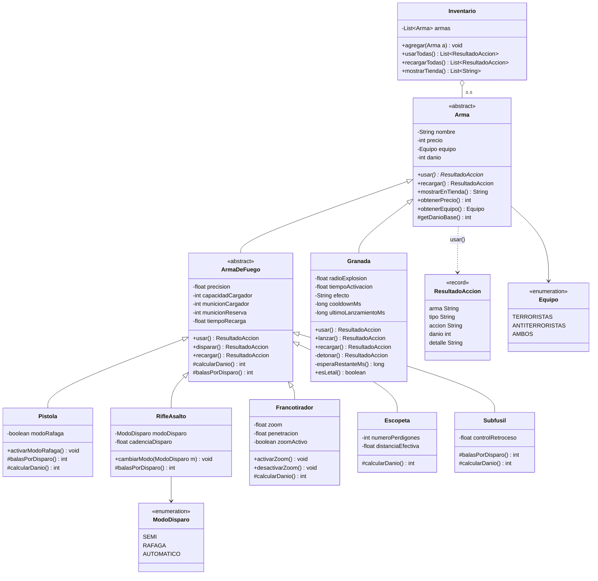

# fg-taller-git-2026

Taller de Git y modelado orientado a objetos — Lenguaje de Programación 3 (CYT646), 2026.
Servicio HTTP (Spring Boot, API REST) con el modelado de **Counter-Strike 2**.

Arrancar: `./mvnw spring-boot:run` → http://localhost:8080/

## Diagrama de clases (dominio CS2)

