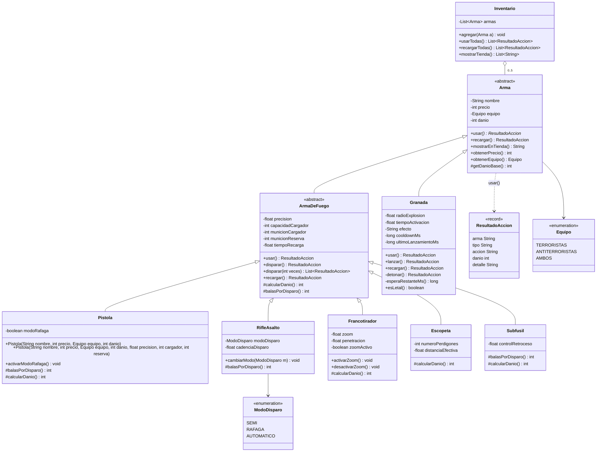

# fg-taller-git-2026

Taller de Git y modelado orientado a objetos — Lenguaje de Programación 3 (CYT646), 2026.
Servicio HTTP (Spring Boot 4, Java 21, API REST) con el modelado de **Counter-Strike 2**.

Licencia: Apache License 2.0 (ver `LICENSE`). Bitácora de asistencia de IA: [`BITACORA.md`](BITACORA.md).

## Cómo arrancar y probar

```bash
./mvnw spring-boot:run
```

| Endpoint | Qué devuelve |
|---|---|
| `GET /` | Estado del servicio, autor y dominio |
| `GET /api/armas/pistola?nombre=USP-S&precio=200&equipo=ANTITERRORISTAS&danio=35` | Construye una `Pistola` con los parámetros de la URL |
| `GET /api/armas/pistola?...&precision=NaN` | 400: la clase rechaza el valor |
| `GET /api/armas/comportamientos` | `mostrarEnTienda()`, `usar()` y `recargar()` de una `Pistola` y una `Granada` tratadas como `Arma` |
| `GET /api/armas/tienda` | Catálogo de la tienda |

## Estructura de paquetes (según `alefq/lp3-template-tp`)

```text
src/main/java/py/edu/uc/lp3/
├── FgTallerGit2026Application.java
├── constants/        ApiPaths: rutas de la API
├── domain/           Modelo CS2: Arma, ArmaDeFuego, Granada, Pistola, RifleAsalto,
│                     Francotirador, Escopeta, Subfusil, Inventario, ResultadoAccion, enums
├── service/          ArmaService (interfaz)
│   └── impl/         ArmaServiceImpl: arma los objetos del dominio
└── rest/
    ├── controller/   IndexController, ArmaController, ComportamientoController
    └── handler/      ManejoErrores: IllegalArgumentException → HTTP 400
```

El dominio no conoce a Spring. Los controllers solo reciben el pedido, llaman al servicio y devuelven JSON; las reglas (daño, munición, cooldown) viven en las clases de `domain`.

## Sobreescritura y sobrecarga

### Sobreescritura (`@Override`): misma firma, la clase hija cambia el comportamiento

| Método | Declarado en | Sobreescrito en | Qué hace cada una |
|---|---|---|---|
| `usar()` | `Arma` (**abstracto**) | `ArmaDeFuego`, `Granada` | El arma de fuego dispara y gasta munición; la granada se lanza y respeta el cooldown |
| `recargar()` | `Arma` (por defecto: "sin recarga") | `ArmaDeFuego` (`final`), `Granada` | El arma de fuego llena el cargador desde la reserva; la granada informa cuánto falta del cooldown |
| `calcularDanio()` | `ArmaDeFuego` (daño × precisión) | `Pistola`, `Francotirador`, `Escopeta`, `Subfusil` | Pistola: llama a `super` y resta 20 % en ráfaga. Francotirador: con zoom **reemplaza** al padre (daño × (1 + penetración)). Escopeta: `super` × perdigones. Subfusil: `super` ajustado por retroceso |
| `balasPorDisparo()` | `ArmaDeFuego` (1) | `Pistola`, `RifleAsalto`, `Subfusil` | Pistola: 1 o 3 en ráfaga. Rifle: lo decide el `ModoDisparo`. Subfusil: 2 |

`ComportamientoController` recorre una `List<Arma>` y llama a `usar()` / `recargar()` sin preguntar el tipo: Java elige en **tiempo de ejecución** la versión de la clase real del objeto.

### Sobrecarga: mismo nombre, distinta lista de parámetros, en la misma clase

| Clase | Firmas | Para qué |
|---|---|---|
| `Pistola` (constructor) | `Pistola(nombre, precio, equipo, danio)` y `Pistola(nombre, precio, equipo, danio, precision, cargador, reserva)` | La corta crea una pistola "de fábrica" y delega con `this(...)` en la completa, así las validaciones están en un solo lugar y las dos dejan el objeto válido |
| `ArmaDeFuego` (mensaje) | `disparar()` y `disparar(int veces)` | Un disparo, o varios seguidos; la versión con `int` valida `1..capacidadCargador` y reutiliza `disparar()` |

### Cómo distinguirlas

| | Sobreescritura | Sobrecarga |
|---|---|---|
| Firma | Igual a la del padre | Mismo nombre, **parámetros distintos** |
| Dónde | Clase hija respecto de la padre | Normalmente en la misma clase |
| Se decide | En ejecución, según el objeto real | Al compilar, según los argumentos |
| Marca | `@Override` | Ninguna |
| Ejemplo acá | `Granada.usar()` reemplaza a `Arma.usar()` | `disparar()` vs `disparar(3)` |

## Diagrama de clases (dominio CS2)


```mermaid
classDiagram
  direction TB

  class Arma {
    <<abstract>>
    -String nombre
    -int precio
    -Equipo equipo
    -int danio
    +usar() ResultadoAccion*
    +recargar() ResultadoAccion
    +mostrarEnTienda() String
    +obtenerPrecio() int
    +obtenerEquipo() Equipo
    #getDanioBase() int
  }

  class ArmaDeFuego {
    <<abstract>>
    -float precision
    -int capacidadCargador
    -int municionCargador
    -int municionReserva
    -float tiempoRecarga
    +usar() ResultadoAccion
    +disparar() ResultadoAccion
    +disparar(int veces) List~ResultadoAccion~
    +recargar() ResultadoAccion
    #calcularDanio() int
    #balasPorDisparo() int
  }

  class Granada {
    -float radioExplosion
    -float tiempoActivacion
    -String efecto
    -long cooldownMs
    -long ultimoLanzamientoMs
    +usar() ResultadoAccion
    +lanzar() ResultadoAccion
    +recargar() ResultadoAccion
    -detonar() ResultadoAccion
    -esperaRestanteMs() long
    +esLetal() boolean
  }

  class Pistola {
    -boolean modoRafaga
    +Pistola(String nombre, int precio, Equipo equipo, int danio)
    +Pistola(String nombre, int precio, Equipo equipo, int danio, float precision, int cargador, int reserva)
    +activarModoRafaga() void
    #balasPorDisparo() int
    #calcularDanio() int
  }

  class RifleAsalto {
    -ModoDisparo modoDisparo
    -float cadenciaDisparo
    +cambiarModo(ModoDisparo m) void
    #balasPorDisparo() int
  }

  class Francotirador {
    -float zoom
    -float penetracion
    -boolean zoomActivo
    +activarZoom() void
    +desactivarZoom() void
    #calcularDanio() int
  }

  class Escopeta {
    -int numeroPerdigones
    -float distanciaEfectiva
    #calcularDanio() int
  }

  class Subfusil {
    -float controlRetroceso
    #balasPorDisparo() int
    #calcularDanio() int
  }

  class Inventario {
    -List~Arma~ armas
    +agregar(Arma a) void
    +usarTodas() List~ResultadoAccion~
    +recargarTodas() List~ResultadoAccion~
    +mostrarTienda() List~String~
  }

  class ResultadoAccion {
    <<record>>
    arma String
    tipo String
    accion String
    danio int
    detalle String
  }

  class Equipo {
    <<enumeration>>
    TERRORISTAS
    ANTITERRORISTAS
    AMBOS
  }

  class ModoDisparo {
    <<enumeration>>
    SEMI
    RAFAGA
    AUTOMATICO
  }

  Arma <|-- ArmaDeFuego
  Arma <|-- Granada
  ArmaDeFuego <|-- Pistola
  ArmaDeFuego <|-- RifleAsalto
  ArmaDeFuego <|-- Francotirador
  ArmaDeFuego <|-- Escopeta
  ArmaDeFuego <|-- Subfusil

  Arma --> Equipo
  RifleAsalto --> ModoDisparo
  Inventario o-- "0..5" Arma
  Arma ..> ResultadoAccion : usar()
```
